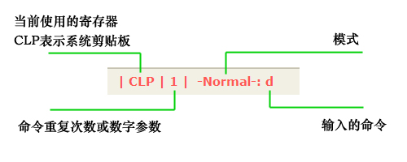

# WinCmdMode

[WinCmdMode](https://github.com/ljylin/WinCmdMode)是一个基于AutoHotKey的脚本，受到了VIM编辑器命令模式的启发，目标是通过定义一套模式化的命令，实现大部分场景下通过键盘来操作Windows，尽量不用鼠标。

- WinCmdMode有些命令和操作方式与VIM相似，但并不完全相同，它不是要再造一个VIM模式
- 不仅仅用于文字编辑，它是用来操控安装有Windows的电脑的
- 它是相对通用化的，不像有些软件自带的VIM模式，只能用于软件自身（比如代码编辑器、浏览器等）

## 模式设置

针对Windows的日常使用，WinCmdMode默认设置了6种模式（模式和命令都是可扩充的）：

|  模式  | 说明                                                         |
| :----: | ------------------------------------------------------------ |
| normal | 正常模式，也是默认的模式，定义了常用的编辑类命令，例如移动光标、添加、删除、更改、剪切、复制等，用于任何需要编辑文本的地方。 |
|   mo   | 鼠标和文件管理模式，用于控制鼠标移动、文件管理、浏览网页等。 |
|   mw   | 文字处理模式，通过定义统一的命令来操作各种文字处理软件（word、wps等），目前只实现了word2003版本。 |
|   mx   | 表格处理模式，通过定义统一的命令来操作各种表格处理软件（excel、wps表格等），目前只实现了excel2003版本。 |
|   np   | 代码编辑模式，通过定义统一的命令来操作各种代码编辑器、ide，目前只实现了notepad++版本。 |
|   v    | 选择模式，用于选择文本                                       |

其中normal模式的命令是共享的，其他5个模式可以不用切换模式直接调用normal模式命令，如果其他模式定义了与normal模式同名的命令，将优先调用其他模式的命令，normal模式的同名命令被覆盖。其他5个模式之间是独立的，即使有同名命令也不会互相影响。

## 文件结构

`WinCmdMode.ahk`是整个脚本的核心，用于识别、处理、调用模式和命令；定义了一些函数供各模式的命令调用 ，以方便命令的编写；脚本的处理逻辑决定了定义模式和命令需要遵循一定的规则。

实事上仅通过这个核心文件便可以定义自己的模式和命令，实现自己想要的功能，预置的6种模式和命令只是针对特定需求的具体实现而已，并非必要。关于如何定义自己的模式和命令及这个核心文件的详细说明后续进行更新。

除此之外，核心脚本还实现了以下特性：

- 支持命令重复执行，先输入数字再输入命令能使命令执行多次，如：输入`2p`将执行两次粘贴操作。
- 提供了`a-zA-Z`52个寄存器，供用户保存文本，存入`a-z`寄存器的内容为覆盖写入，存入`A-Z`寄存器的内容为追加写入，并提供了改写机制来改变寄存器的行为，比如将某个寄存器改造为后进先出的堆栈。
- 提供了内部寄存器对象，供命令运行时存储临时数据。

其他6个模式的命令都在单独的文件中定义，如`normal.ahk`、`mw_word2003.ahk`等，在`WinCmdMode.ahk`文件的最后通过`#Include`指令引入。

`RegisterFunc.ahk`文件用于存放自定义寄存器函数，改变寄存器的默认行为。作为示例，已定义了`F`寄存器函数，使`F`寄存器实现了数据的先进先出。

对于一些常用的、重复性的繁杂操作，用户可以自己编写autohotkey脚本来自动运行，将脚本放入`GoScript.ahk`文件，需要时通过mo模式的`go`命令进行调用。

## 使用说明

首先确保已经安装了AutoHotKey，直接运行`WinCmdMode.ahk`文件，由于`CapsLock`键被设定为命令模式的开关键，按下`CapsLock`键，屏幕右上角会显示状态指示栏，同时键盘的`ScrollLock`指示灯点亮，表明已进入命令模式（默认为normal模式），后续所有的键盘输入都会被当作命令来解释，状态指示栏各部分的说明见下图：

现在可以输入命令了，命令是区分大小写的，由于`CapsLock`键被占用，大写字符只能通过按住`shift`键输入

- 要切换模式，直接输入模式名
- 由于鼠标操作（mo模式）很常用，`.`键被定义为快速切换键，任何模式下按下`.`键都会切换到mo模式，再次按下切换回之前的模式
- 如果发现命令输入有误，可以用`CapsLock`键退出命令模式再重新进入，缓存的输入会被清除
- 要输入文本，可以用`CapsLock`键退出命令模式或输入能进入文本插入状态的命令（例如`i`、`A`等命令）
- 在命令之前输入数字可以使命令执行多次，例如：输入`2p`将执行两次粘贴操作。
- 在命令之前使用`"`键可以临时切换要使用的寄存器，例如输入`"ap`表示粘贴寄存器a里的内容，而不是系统剪贴板的

目前还没有各模式已定义命令的详细说明，可以直接查看各模式的脚本文件，其中大部分命令只是对快捷键的简单封装而已，再加上有注释，简单试用一下就能知道各命令的作用，需要注意的是命令定义中的大写字母是用`@`表示的，比如`A`用`@a`表示。

需要特别说明的是mo模式
